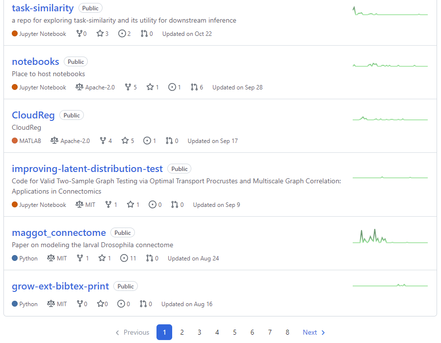
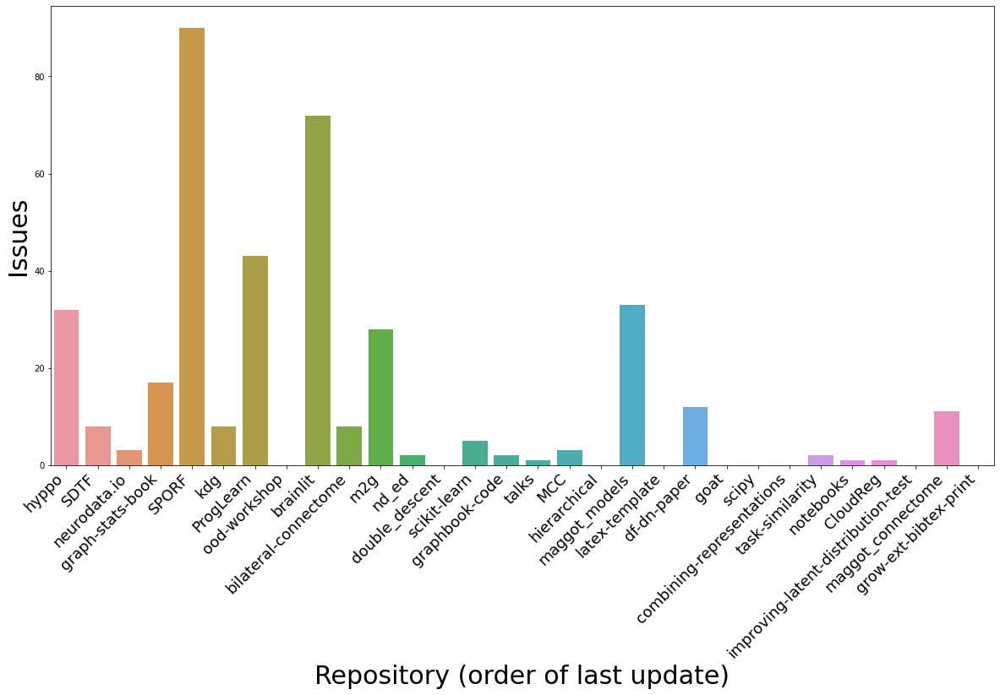

# Web Scrapping Github Repositories

In order to grasp a comprehensive scope of current status of all repositories under our lab, I built this brief web scraper to organize my workflow. The motivation for search selection is based on the need of each repo. To gauge the level of needs, I chose to parse out `the number of issues`. Additionally, `last updated dates` are also important to understand whether the repo is actively managed at this time.

For each page that lists repositories, individual url was used to request html output. Then there were two items that were parsed out from the html output which was converted into utf-8 format. 

Aforementioned attributes of interest were parsed using `re` and in-built string methods.

The following two filters were applied to further narrow down the list.
1. Nubmer of Issues > 0
2. Last Updated Date is no earlier than `2021-09-01`

